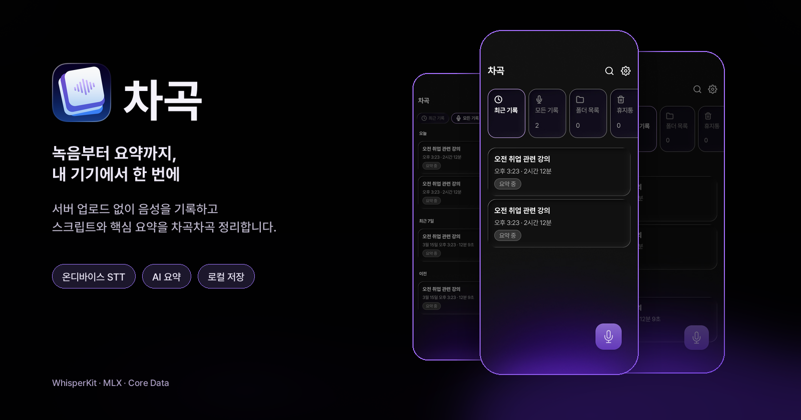
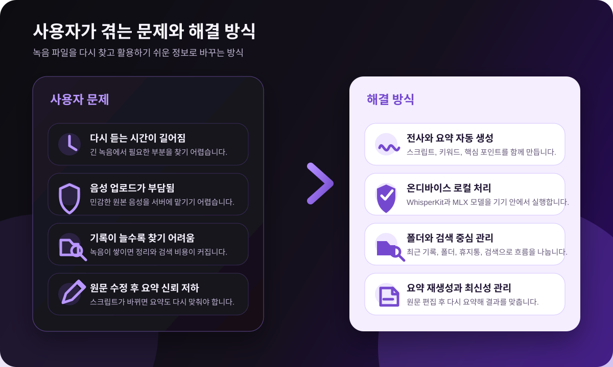
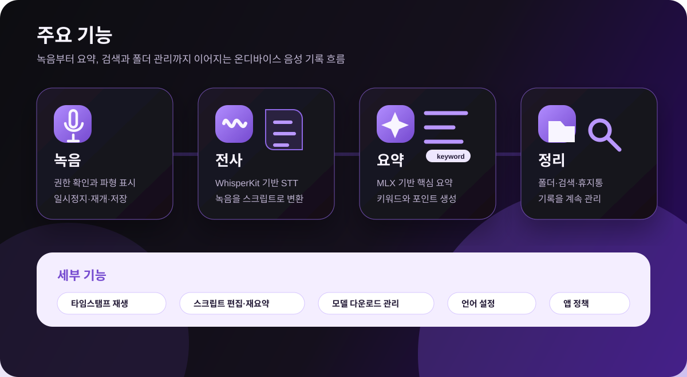
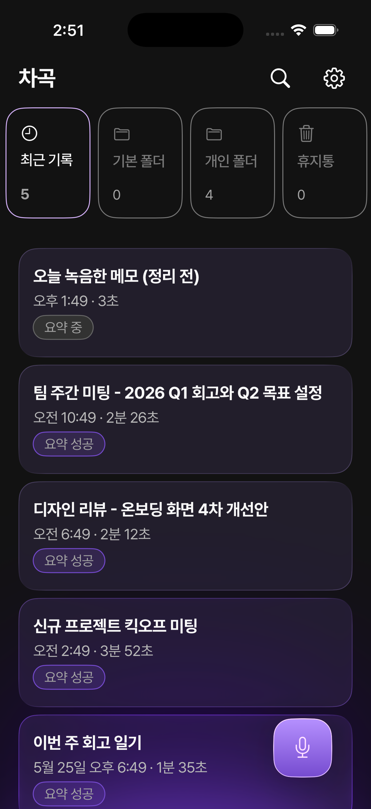
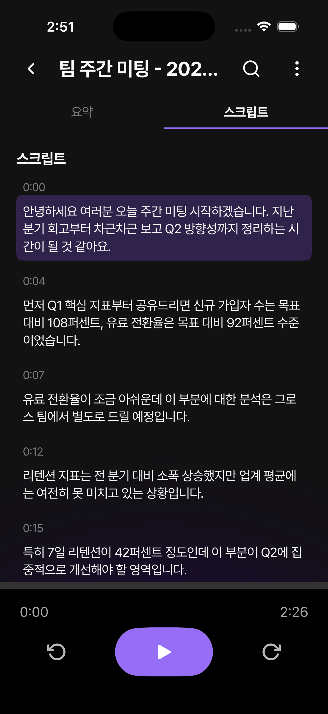
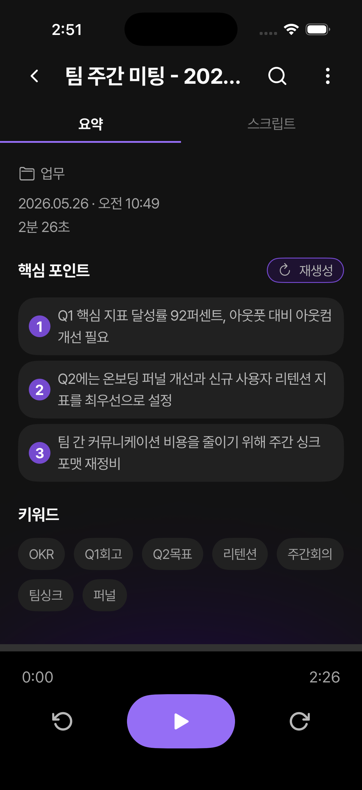
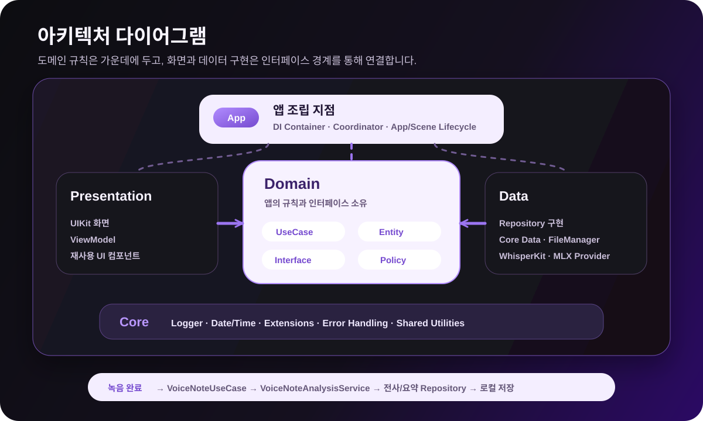

# 차곡 (ChaGok)

서버 업로드 없이 녹음부터 전사, 키워드 추출, 요약까지 기기 안에서 처리하는 iOS 음성 기록 앱입니다.



## 프로젝트 소개

차곡은 회의, 강의, 인터뷰, 아이디어 메모처럼 나중에 다시 찾아야 하는 음성 기록을 안전하게 쌓아두기 위한 앱입니다. 사용자는 앱에서 바로 녹음하고, 녹음이 끝나면 WhisperKit 기반 STT와 MLX 기반 온디바이스 LLM 요약 파이프라인을 통해 스크립트, 키워드, 핵심 요약을 확인할 수 있습니다.

## 문제 정의와 해결 방향




## 주요 기능



- 녹음: 마이크 권한 확인, 녹음 시작/일시정지/재개/종료, 실시간 파형 표시
- 온디바이스 분석: WhisperKit 전사, MLX 기반 요약, 키워드와 핵심 포인트 생성
- 음성 노트 상세: 요약/스크립트 탭, 오디오 재생, 타임스탬프 이동, 제목 및 스크립트 편집
- 정리와 검색: 최근 기록, 전체 기록, 폴더, 휴지통, 검색 결과 하이라이트
- 모델과 설정: 온보딩/설정에서 모델 다운로드와 삭제, 기록 언어와 앱 정책 관리

## 대표 화면

|                                 기록 목록                                  |                                  스크립트                                   |                                   요약                                   |
|:--------------------------------------------------------------------------:|:---------------------------------------------------------------------------:|:------------------------------------------------------------------------:|
|  |  |  |
|     최근 기록, 기본 폴더, 개인 폴더, 휴지통을 한 화면에서 확인합니다.      |     타임스탬프가 있는 스크립트와 오디오 재생 컨트롤을 함께 제공합니다.      |   핵심 포인트, 키워드, 요약 재생성을 통해 긴 기록을 빠르게 파악합니다.   |

## 아키텍처 및 폴더 구조



### 폴더 구조

```text
ChaGok
├── App            # 앱 진입점, DI, Coordinator
├── Presentation   # UIKit 화면, ViewModel, 재사용 UI 컴포넌트
├── Domain         # Entity, UseCase, Repository Interface, 도메인 정책
├── Data           # Repository 구현, Core Data, 온디바이스 모델 Provider
├── Core           # Logger, 날짜/시간 포맷, 공통 확장과 유틸리티
├── Tuist          # 프로젝트 설정과 외부 패키지 정의
└── fastlane       # 인증서 동기화와 배포 lane
```

## 기술 스택

| 영역          | 사용 기술                                            |
|---------------|------------------------------------------------------|
| Language      | Swift 6.0                                            |
| UI            | UIKit, Observation, Auto Layout                      |
| Architecture  | Layer-based multi-module, MVVM, Coordinator, Pure DI |
| Project       | Tuist 4.158.0, mise                                  |
| Local storage | Core Data, FileManager, UserDefaults                 |
| Audio         | AVFoundation, Speech                                 |
| On-device STT | WhisperKit, ArgmaxOSS                                |
| On-device LLM | MLX Swift, MLX Swift LM, HuggingFace, Tokenizers     |
| Test          | XCTest, DomainTesting mocks/stubs                    |
| Tooling       | SwiftFormat, fastlane                                |

## 실행 방법

### 요구 사항

- macOS와 Xcode
- iOS SDK 26.0 이상
- Tuist 4.158.0
- Ruby 3.3.7 (fastlane 사용 시)
- 실제 기기 빌드 시 코드 사이닝 프로파일 또는 fastlane match 접근 권한

### 프로젝트 생성

```bash
mise install
tuist install
tuist generate
```

## 문서

- [프로젝트 위키](../iOS.wiki/Home.md)
- [개발 표준](../iOS.wiki/Development/Development.md)
- [코딩 컨벤션](../iOS.wiki/Development/Coding-Convention.md)
- [테스트 전략](../iOS.wiki/Development/Testing-Strategy.md)
- [녹음 플로우](../iOS.wiki/Development/AudioService-Recording-Flow.md)
